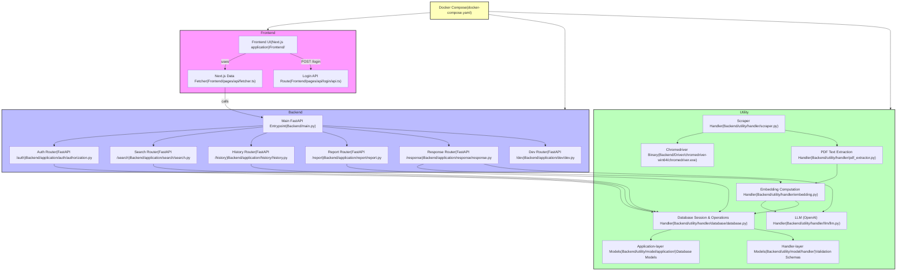

# 台灣經濟部智慧財產局專利檢索系統爬蟲

# Update Log

## V0.9 update 19/5/2025

Feat: Add response history tracking and PDF text extraction

- Implemented response history tracking in `response.py` using the new `ResponseHistoryScheme`.
- Enhanced `/search` and `/scraper/` endpoints to include PDF text extraction and embedding using `PDFExtractor`.
- Introduced vector embeddings for PDF content in `search.py` with `PDFChunkEmbedding`.
- Updated database schema to include content and image vector tables and response history table.
- Removed redundant `feature_extractor.py` and refactored `embedding.py` to align with new structure.

## V0.8 update 16/5/2025

Feat: Introduce ChatHistoryScheme and SearchHistoryScheme

- Added ChatHistoryScheme model for managing chat-related data in the database.
- Refactored HistoryScheme to SearchHistoryScheme to clarify its purpose.
- Updated related database handler methods to use SearchHistoryScheme.
- Implemented connection testing in the database handler and raised NoConnectionError when necessary.

Build: Add OpenAI package

- Added openai package version 1.78.1 to pyproject.toml and uv.lock.

Refactor: Remove redundant logger statements

- Removed unnecessary debug logs in dependency.py and database.py.

Fix: Correct history and search handler references

- Adjusted references to HistoryScheme to SearchHistoryScheme in history.py and search.py.

## V0.7 update 15/5/2025

Refactor: Improve transaction handling in database module

- Replaced transaction_session with session for consistency.
- Enhanced error handling in run_transaction and run_raw_query.
- Added parameter support in run_raw_query.

Feat: Add vector insertion method in scraper

- Implemented insert_vector method to insert vector embeddings with metadata.

Fix: Add critical log statements for missing/expired tokens

Added critical log statements in dependency.py for cases when the access token is missing or expired and no refresh token is provided.

Refactor: Update scraper model and usage

- Replaced PatentInfo with PatentModel in scraper-related modules.
- Adjusted get_patent_information and related methods to return PatentModel.

Refactor: Remove unused scraper endpoints in dev.py

- Commented out the /download/ endpoint as it is no longer required.
- Removed unused imports and client instantiation related to scraper operations.

Feat: Enhance search endpoint with access token dependency

- Modified the /search/ endpoint to require an access_token.
- Added logging for each search entry in the user’s search history.

Refactor: Consolidate router tags in main.py

- Removed redundant version identifiers from router tags for consistency.

Refactor: Rename id to patent_id in PatentScheme

- Updated the primary key in PatentScheme to patent_id.
- Adjusted references throughout related modules.

Chore: Update type hints for pgvector import

- Added # type: ignore[import-untyped] for pgvector imports.

Remove: Result (same as report)
deleted: Backend/utility/model/application/result.py
renamed: Frontend/pages/results/index.tsx -> Frontend/pages/report/index.tsx

Refactor: Simplify endpoint paths in result and search modules

Updated endpoint paths in result.py and search.py to remove trailing slashes.

Refactor: Rename variable in authorization module for clarity

Renamed insert_stmt to operation in authorization.py for consistency.

Feat: Add error classes for database operations

Added specific error classes in database.py for insert, select, delete, update, alter, and drop operations.

Feat: Implement insert search history operation in history module

Added insert_search_history method in history.py to handle search history insertions, raising InsertError on failure.

## V0.6 update 13/5/2025

Feat: Update JWT verification to use cookies

Refactored JWT verification to retrieve access and refresh tokens from cookies instead of headers. Updated relevant function signatures and documentation to reflect this change.

Feat: Add search and login history retrieval endpoints

Implemented new endpoints to fetch search history and last login records for a user. Added error handling for missing records.

Feat: Update database schema for login records

Modified LoginScheme to use mapped types for column definitions. Adjusted data types and added datetime mappings.

## V0.5 update 25/4/2025

Feat: Add API router prefixes and new download endpoint
Refactor: Remove legacy scraper.py and update DB operations

Added prefix configurations for authorization, dev, history, report, result, and search routers to streamline API paths.
Removed the standalone scraper.py and migrated its functionality into a new /download/ endpoint in the dev router with proper database insertion.
Updated environment-variable handling in the dependency module for consistency and formatting.
Implemented UPSERT behavior for LoginScheme in AuthorizationOperation and added fetch_refresh_token, revoke_access_token, and update_refresh_token methods.
Introduced HistoryScheme model for user search history tracking and enhanced SearchEngineOperation to return a structured SearchResult including a UTC timestamp.

## V0.4 update 15/4/2025

Refactor role/user creation logic and enhance DB access patterns

- Improved input validation and error handling in /new-role/ and /new-user/ endpoints.
- Switched return types to include full Role and User objects for consistency.
- Expanded docstrings in database access classes for clarity and maintainability.
- Fixed field extraction in fetch_user_by_name and fetch_user_by_id to correct mapping.
- Deleted search.py route as it's no longer used; updated imports accordingly.
- Enhanced logging and error output in database transaction methods.
- Added SQLAlchemy TSVECTOR column for PostgreSQL full-text indexing.
- Created .sql ignore rule in .gitignore for cleaner repo state.

## V0.3 update 14/4/2025

Refactor auth routing and remove legacy database layer

- Removed authorization.py and moved route registration to application.auth.
- Adjusted API prefix to /api/v1/authorization for clarity and REST alignment.
- Deleted Database class and associated config model, indicating a move away from custom DB access logic.
- Replaced logger initialization with a shared global logger using Logger().get_logger().
- Commented out raw DB usage in scraper.py, likely preparing for refactor or ORM transition.
- Updated dependencies in pyproject.toml to support new modules like passlib, sqlalchemy, and python-jose.

## V0.2 update 28/3/2025

Add installation guide and AI-related dependencies; disable Milvus handlers

- Updated `README.md` to include steps for using `uv` for package management.
- Added dependencies including `einops`, `pymilvus`, `sentence-transformers`, and `transformers` to support NLP and vector database functionalities.
- Commented out `insert_sentence` and `search_similarity` methods in `vector_database.py`—likely part of a temporary pause or refactor of Milvus-based operations.

## V0.1 update 20/3/2025

Initialize backend utilities and frontend project setup

- Added vector database handlers in `Backend/utility/handler/` and `Backend/utility/model/handler/`.
- Initialized the frontend project with Next.js, including essential configuration files.
- Added frontend components such as `navbar.tsx`, `theme-switch.tsx`, and `transition.tsx`.
- Configured ESLint, TypeScript, and Tailwind for frontend development.
- Included project documentation (`README.md`, `LICENSE`).
